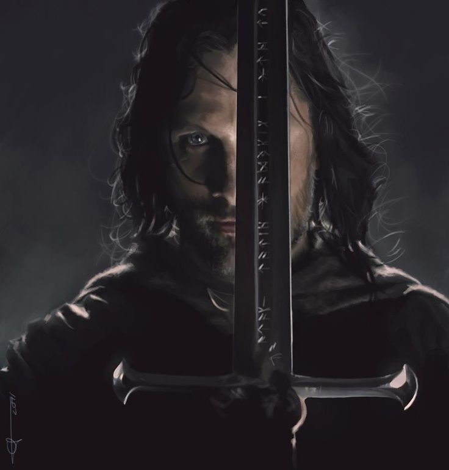

All that is gold does not glitter,  
Not all those who wander are lost;  
The old that is strong does not wither,  
Deep roots are not reached by the frost.

From the ashes a fire shall be woken,  
A light from the shadows shall spring;  
Renewed shall be blade that was broken:  
The crownless again shall be king.

— J.R.R. Tolkien, "The Lord of the Rings: The Fellowship of the Ring"

<!-- Не всякое золото ярко блестит,
Не всякий скиталец — бродяга.
Глубокие корни мороз не убьет,
Не скиснет крепкая брага.

Пламя взовьется из пепла,
Клинок возрожденный блеснет,
И наследник, власти лишенный,
Корону вновь обретет! -->

