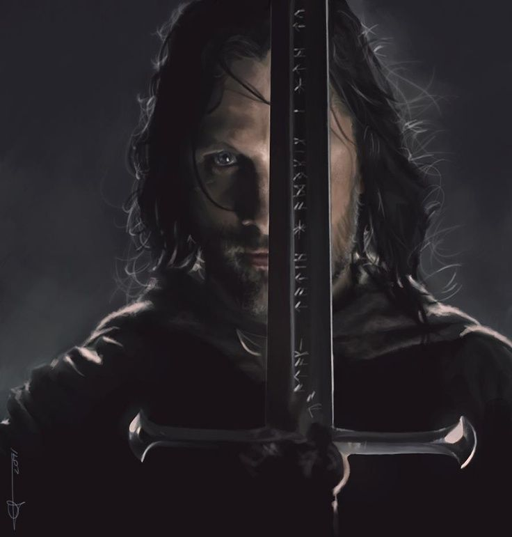

Не всякое золото ярко блестит,  
Не всякий скиталец — бродяга.  
Глубокие корни мороз не убьет,  
Не скиснет крепкая брага.  
  
Пламя взовьется из пепла,  
Клинок возрожденный блеснет,  
И наследник, власти лишенный,  
Корону вновь обретет!  
  
— Дж. Р. Р. Толкин, "Властелин колец: Братство Кольца"  

